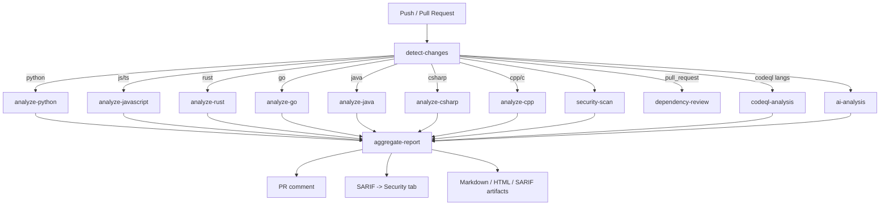

w# 🔮 Ahead-of-Time Bug Prediction

An autonomous CI system that analyzes every pull request and push, predicts which changes are likely
to become production bugs, and posts a scored, explained, fix-suggesting report — before anything ships.

It combines traditional static analysis (best tool per language, auto-selected), dependency/secret/license
security scanning, CodeQL semantic analysis, and an AI-assisted review layer that works with GitHub Models,
a local/self-hosted LLM, or a zero-dependency heuristic engine, whichever is available.

> This document describes the bug-prediction system added to this repository. It is independent of, and
> does not replace, any documentation for the Eminium Games Launcher application itself.

## Contents

- [What it does](#what-it-does)
- [How it works](#how-it-works)
- [Repository layout](#repository-layout)
- [Supported languages & tools](#supported-languages--tools)
- [AI integration & fallback strategy](#ai-integration--fallback-strategy)
- [Understanding the report](#understanding-the-report)
- [Configuration](#configuration)
- [Installation](#installation)
- [Running it locally](#running-it-locally)
- [Strict / blocking mode](#strict--blocking-mode)
- [Extending the system](#extending-the-system)
- [Limitations](#limitations)

## What it does

On every pull request, push, and (optionally) on a weekly schedule, the workflow:

- Detects exactly which files changed and which languages are affected, so unaffected language jobs are
  skipped entirely and every tool that supports it only analyzes changed files.
- Runs the best available static analyzer(s) for each of Python, JavaScript, TypeScript, Rust, Go, Java,
  C#, C++ and C, automatically, without any per-repo configuration.
- Runs CodeQL semantic analysis for the languages it supports among the ones that changed.
- Runs secret scanning (Gitleaks), dependency/CVE scanning (OSV-Scanner), supply-chain and license review
  (GitHub Dependency Review + a lightweight declared-license check), and cross-language pattern rules
  (Semgrep).
- Runs an AI-assisted review pass (GitHub Models by default, a local/self-hosted OpenAI-compatible model
  if reachable, or a dependency-free heuristic engine as a last resort) specifically targeting logic
  errors, null/undefined issues, race conditions, memory/resource leaks, unsafe async code, API misuse,
  broken error handling, risky refactors and code smells.
- Scores every single finding with a **severity**, a **confidence**, an estimated **bug probability**, and
  a single 0-100 **risk score**, deduplicating and corroborating findings that multiple tools agree on.
- Publishes a Markdown executive summary as a PR comment (created once, then updated on every push), a
  full Markdown report, a SARIF file (uploaded to GitHub's Security tab), and a self-contained HTML report
  — all three attached to the workflow run as artifacts.
- Keeps running even when an individual tool fails or isn't installable for a given repository; the final
  report always reflects whatever analyzers actually produced output.

## How it works



Every analyzer job follows the same two-phase pattern:

1. **Run the tool(s)** as plain shell steps, each with `continue-on-error: true`, writing raw native output
   (JSON/XML/SARIF/text) into a `raw/` directory. This keeps each tool's own logs visible in the Actions UI.
2. **Unify the output** with a small Python parser (`scripts/bugpredict/analyzers/*.py`) that converts
   whatever raw files exist into the project's single `Issue` schema (see
   `scripts/bugpredict/core/models.py`). Missing/failed tools are logged and skipped, never fatal.

The `aggregate-report` job then downloads every analyzer's unified JSON, deduplicates overlapping findings
(the same location + category flagged by more than one tool has its confidence boosted, not double-counted),
recomputes consistent risk scores, and renders the final reports.

## Repository layout

```
.
├── .github/
│   ├── workflows/
│   │   ├── bug-prediction.yml         # the main autonomous pipeline (this system)
│   │   ├── bugpredict-selftest.yml    # unit tests for the helper scripts themselves
│   │   └── release.yml                # pre-existing launcher release workflow (untouched)
│   └── actions/
│       └── setup-python-env/          # reusable composite action (Python + pip cache)
│
├── .bugpredict/                       # all configuration for the bug-prediction system
│   ├── config.yml                     # central config: AI, scoring weights, thresholds
│   ├── ruff.toml / pylintrc / mypy.ini   # Python tool configs
│   ├── eslint.config.mjs / package.json / package-lock.json  # self-contained JS/TS toolkit
│   ├── golangci.yml                   # Go linter config (golangci-lint v2 schema)
│   ├── semgrep.yml                    # custom cross-language Semgrep rules
│   ├── codeql-config.yml              # CodeQL query pack + path filters
│   ├── license-allowlist.txt          # SPDX identifiers allowed by the license checker
│   └── INSTALL.md                     # step-by-step setup & customization guide
│
├── scripts/
│   ├── requirements.txt               # single optional dependency: PyYAML
│   └── bugpredict/                    # the whole system's implementation
│       ├── detect_changes.py          # git diff -> changed files -> per-language flags
│       ├── extract_files.py           # per-language changed-file list for shell steps
│       ├── run_analysis.py            # aggregate + gate CLI entrypoint
│       ├── pr_comment.py              # posts/updates the PR comment via the GitHub REST API
│       ├── core/                      # Issue schema, scoring engine, aggregator, report renderers
│       ├── analyzers/                 # one parser per language/ecosystem -> unified Issue schema
│       ├── ai/                        # OpenAI-compatible client, prompts, provider fallback chain
│       └── heuristics/                # zero-dependency static analysis (the AI fallback layer)
│
├── tests/bugpredict/                  # unit tests for the scoring/aggregation/classification logic
└── BUG_PREDICTION.md                  # this file
```

## Supported languages & tools

| Language | Static analysis | Security | Notes |
|---|---|---|---|
| Python | Ruff, Pylint, Mypy | Bandit | Ruff covers bugbear/async/perf/exception-handling rule families |
| JavaScript / TypeScript | ESLint (self-contained toolkit) | eslint-plugin-security | TypeScript compiler (`tsc --noEmit`) adds real type/null-safety errors when a `tsconfig.json` is present |
| Rust | Clippy | cargo-audit | Toolchain via `dtolnay/rust-toolchain@stable`, cached via `Swatinem/rust-cache` |
| Go | golangci-lint (govet, staticcheck, errcheck, gosec, bodyclose, ...) | govulncheck | golangci-lint v2 config schema |
| Java | PMD (source-based, always runs) | SpotBugs (bytecode-based, best-effort) | SpotBugs requires a buildable Maven/Gradle project; PMD never does |
| C# | Roslyn analyzers via `dotnet build /p:ErrorLog=...` | Built-in nullable/security rules | Requires a `.sln`/`.csproj` in the repository |
| C / C++ | cppcheck, clang-tidy | — | Both run per-file against only the changed files |
| All of the above | Semgrep (`p/security-audit`, `p/owasp-top-ten`, custom rules) | Gitleaks, OSV-Scanner, Dependency Review | Cross-cutting, language-agnostic layer |
| All of the above | CodeQL (`security-and-quality` query pack) | — | Matrixed only over languages that both changed and are CodeQL-supported |

Tool selection is fully automatic based on which files changed — there is nothing to configure per
repository beyond `.bugpredict/config.yml`.

## AI integration & fallback strategy

The AI-assisted analysis job (`scripts/bugpredict/ai/ai_analyzer.py`) tries providers in this order and
never depends exclusively on any single one, let alone a proprietary cloud service:

1. **GitHub Models** — uses the workflow's own `GITHUB_TOKEN` against
   `https://models.github.ai/inference/chat/completions` (requires only the `models: read` job permission,
   already granted in the workflow). Works with zero secrets/configuration on any repository with GitHub
   Models access.
2. **Local / self-hosted model** — if a self-hosted runner exposes an OpenAI-compatible server (Ollama,
   vLLM, LM Studio, text-generation-webui, ...), point `OLLAMA_HOST`/`AI_ENDPOINT` at it (see
   [Configuration](#configuration)) and it is used automatically once reachability is confirmed.
3. **Heuristic static analysis** — a pure Python, dependency-free engine
   (`scripts/bugpredict/heuristics/`) using the `ast` module for Python and curated regex rules for every
   other language. It always runs (even as a supplement when an AI backend succeeds) and guarantees the
   workflow produces a meaningful report with zero network access and zero paid services.

The `ai_backend` used on a given run is always shown in the executive summary of the report, so it is
never ambiguous which layer actually produced a given AI-sourced finding (tagged `ai:github_models`,
`ai:ollama`, or `heuristic:*` in the `tool` field of each issue).

## Understanding the report

Every finding carries four numbers, computed consistently in `scripts/bugpredict/core/scoring.py`
regardless of which tool produced it:

| Field | Range | Meaning |
|---|---|---|
| **Severity** | critical / high / medium / low / info | The originating tool's own assessment of impact, normalized to one scale. |
| **Confidence** | 0-100% | How sure the system is that this specific finding is real (not a false positive). Boosted when multiple independent tools flag the same spot. |
| **Bug probability** | 0-100% | Estimated likelihood this becomes an actual production incident if left unaddressed, based on historical risk of the issue's category. |
| **Risk score** | 0-100 | The single sortable priority number = severity × category weight × confidence. Used to bucket issues into 🔴 high (≥75) / 🟠 medium (40-74) / 🟡 low (<40). |

The PR comment groups issues into those three buckets, shows full detail (why it may fail, suggested fix,
and a corrected code snippet when available) for high/medium findings, and a compact table for low-risk
ones to keep the comment readable. The full, untruncated version is always available as a workflow
artifact (Markdown, HTML, and SARIF).

## Configuration

All tunable behavior lives in [`/.bugpredict/config.yml`](.bugpredict/config.yml):

- `general.max_files_per_ai_batch` / `max_file_size_kb` — bound the size/cost of AI requests.
- `general.fail_on_critical`, `risk_score_fail_threshold`, `fail_on_any_high_risk` — see
  [Strict / blocking mode](#strict--blocking-mode).
- `ai.enabled`, `ai.github_models.model`, `ai.ollama.host` / `model` — AI provider settings.
- `scoring.severity_weights`, `scoring.category_multipliers` — tune how much each severity/category
  contributes to the final risk score.
- `reporting.max_issues_in_comment` — cap on low-risk rows shown directly in the PR comment.

Repository/organization **Actions variables** (Settings → Secrets and variables → Actions → Variables) can
override the AI backend without editing YAML:

| Variable | Purpose |
|---|---|
| `BUGPREDICT_AI_MODEL` | GitHub Models model ID, e.g. `openai/gpt-4o-mini`, `meta/Meta-Llama-3.1-8B-Instruct` |
| `BUGPREDICT_AI_ENDPOINT` | Override the chat-completions endpoint entirely (any OpenAI-compatible API) |
| `BUGPREDICT_OLLAMA_HOST` | Base URL of a self-hosted OpenAI-compatible server, e.g. `http://localhost:11434` |
| `BUGPREDICT_OLLAMA_MODEL` | Model name to request from that local server |

See [`.bugpredict/INSTALL.md`](.bugpredict/INSTALL.md) for full setup instructions, required permissions,
and troubleshooting.

## Running it locally

Every stage can be run outside of Actions, which is useful for iterating on the scripts themselves:

```bash
# 1. Compute the changed-file set (or pass --full-scan true to scan everything)
python3 -m scripts.bugpredict.detect_changes --event workflow_dispatch --full-scan true --output changed_files.json

# 2. Run a heuristic-only pass (no network, no external tools) on Python + generic patterns
python3 -m scripts.bugpredict.ai.ai_analyzer --changed-files changed_files.json --output results/ai.json

# 3. Aggregate whatever unified result files exist and render the reports
python3 -m scripts.bugpredict.run_analysis aggregate --input-dir results --output-dir report --repo you/repo
open report/report.html   # or xdg-open on Linux
```

## Strict / blocking mode

By default the workflow is **advisory only**: it never fails the build, no matter what it finds. To turn
it into a blocking check once your team is comfortable with the signal-to-noise ratio, edit
`.bugpredict/config.yml`:

```yaml
general:
  fail_on_critical: true          # enables the gate at all
  risk_score_fail_threshold: 90   # fail if any issue reaches this risk score
  fail_on_any_high_risk: false    # or fail on ANY high-risk (>=75) issue instead
```

Then mark the `aggregate-report` job as a required status check under your branch protection rules.

## Extending the system

- **Add a language**: add its extensions to `LANGUAGE_EXTENSIONS` in `scripts/bugpredict/detect_changes.py`,
  add a `<lang>_analyzer.py` under `scripts/bugpredict/analyzers/`, and add the corresponding job to
  `.github/workflows/bug-prediction.yml` following the existing two-phase (run tool -> unify) pattern.
- **Add a tool for an existing language**: add a step that writes its raw output into `raw/<tool>.<ext>`,
  then add a `parse_<tool>()` function to that language's analyzer module.
- **Tune categorization**: most tools are mapped via a small curated dictionary in their analyzer module,
  falling back to `scripts/bugpredict/core/classify.py`'s keyword classifier for anything not explicitly
  listed.
- **Change scoring**: everything is centralized in `scripts/bugpredict/core/scoring.py` and overridable via
  `.bugpredict/config.yml` without touching code.

## Limitations

- SpotBugs requires a successful Maven/Gradle build; if the project doesn't build in a stock Actions
  runner (missing secrets, native dependencies, etc.), only PMD's source-based findings are available for
  Java. This is called out explicitly in the report's "Analyzers Executed" table.
- C# analysis requires a `.sln`/`.csproj` at (or near) the repository root; loose `.cs` files without a
  project are only covered by the AI/heuristic layer and Semgrep.
- CodeQL's `autobuild` step can fail for unusual build layouts in compiled languages (Java, C#, C/C++, Go);
  this is non-fatal to the overall pipeline but reduces CodeQL's own coverage for that run.
- The AI layer sends full file contents (capped in size and file count) to whichever backend is active.
  When using GitHub Models or any third-party endpoint, review your organization's data-handling policies;
  use the local/self-hosted path or disable `ai.enabled` if this is a concern.
- Risk scores and bug-probability estimates are heuristic, hand-tuned weights, not a statistically fitted
  model — treat them as a triage aid, not a certainty.
